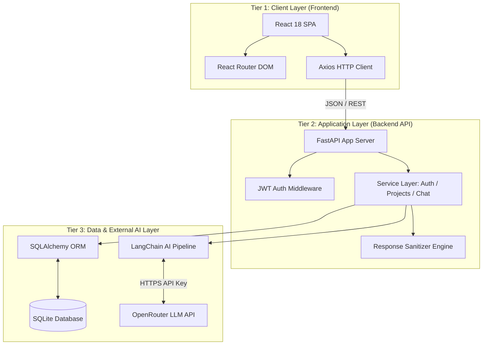
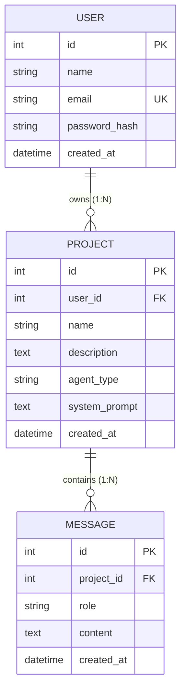
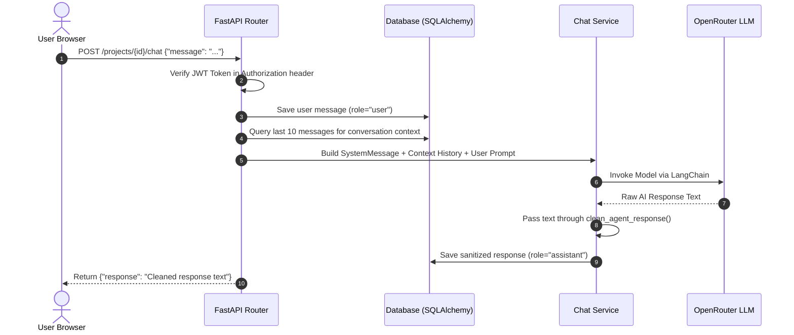

# AI Chatbot Platform – Architecture & System Design Document

## 1. System Architecture Overview

The platform uses a modern **3-Tier Client-Server Architecture** designed for high modularity, clean separation of concerns, and low latency.



---

## 2. Component Design & Layer Responsibilities

### Tier 1: Presentation Layer (Frontend)
- **Framework**: React 18 built with Vite for fast HMR and sub-3-second builds.
- **Routing & State**: React Router handles SPA routing between `Login`, `Register`, `Dashboard`, `CreateProject`, and `Chat`. Token state is synchronized via browser `localStorage`.
- **Styling**: Tailwind CSS combined with clean vanilla CSS tokens for a responsive slate/indigo design.

### Tier 2: Business & Application Layer (Backend API)
- **API Framework**: FastAPI provides high-performance asynchronous endpoints with automatic OpenAPI documentation.
- **Security Design**: Stateless authentication using JWT (JSON Web Tokens) with 30-minute expiration. Passwords are securely hashed using `bcrypt`.
- **Middleware**: CORS middleware permits cross-origin requests from the React frontend.

### Tier 3: Data & LLM Orchestration Layer
- **Persistence**: SQLAlchemy ORM manages relational persistence with SQLite.
- **AI Engine**: LangChain constructs `SystemMessage`, historical `AIMessage`/`HumanMessage` context, and streams calls to OpenRouter (`qwen/qwen3-coder:free`).

---

## 3. Database Architecture & ER Diagram

The database utilizes a relational 3-entity model with cascading foreign key relationships.



---

## 4. Detailed Data & Execution Flow



---

## 5. Key System Design Decisions

1. **Persona-Based System Prompts**:
   - Instead of complex multi-agent overhead, each project is assigned a specialized domain prompt (**Coding**, **Fitness**, **Study**, **General**) upon creation, enforcing role adherence directly at the LLM level.

2. **Response Sanitization Engine (`clean_agent_response`)**:
   - Implements a real-time Regex pipeline that preserves standard markdown code blocks (` ```python ... ``` `) while stripping unwanted symbol clutter (`|`, `**`, `---`, `#`) outside code blocks for clean UI rendering.

3. **Sliding Context Window**:
   - The server fetches the last 10 messages per chat turn, balancing token budget and conversation memory.

4. **Data Isolation**:
   - Every API request validates the authenticated user ID against the project owner ID, preventing unauthorized access.

---

